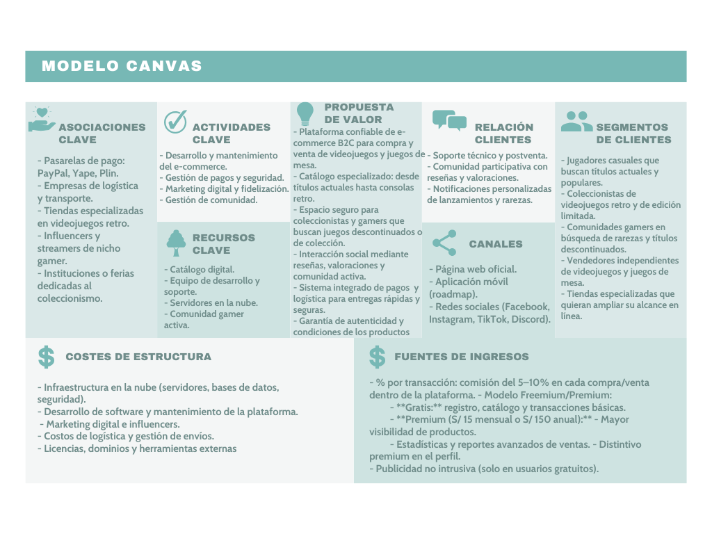

# 1.2. Modelo de Negocio
- [Volver al índice](/1/1.md)

## 1. GameVault con funciones premium (modelo B2C)  
GameVault es una plataforma confiable de **compra y venta de videojuegos y juegos de mesa**, que combina catálogo especializado, comunidad activa y soporte seguro en pagos y logística.  
El modelo de negocio permite monetizar tanto con **comisiones por transacción** como con **planes premium**.  

**Gratis:**  
- Registro y uso de la plataforma.  
- Acceso al catálogo completo.  
- Posibilidad de comprar y vender con funciones básicas.  

**Premium (S/ 15 mensual o S/ 150 anual):**  
- Mayor visibilidad de productos publicados.  
- Estadísticas avanzadas de ventas.  
- Distintivo premium en el perfil.  
- Acceso a beneficios en campañas y promociones especiales.  

## 2. CANVAS
A continuación se muestra el desarrollo del modelo de negocio de "GameVault":

