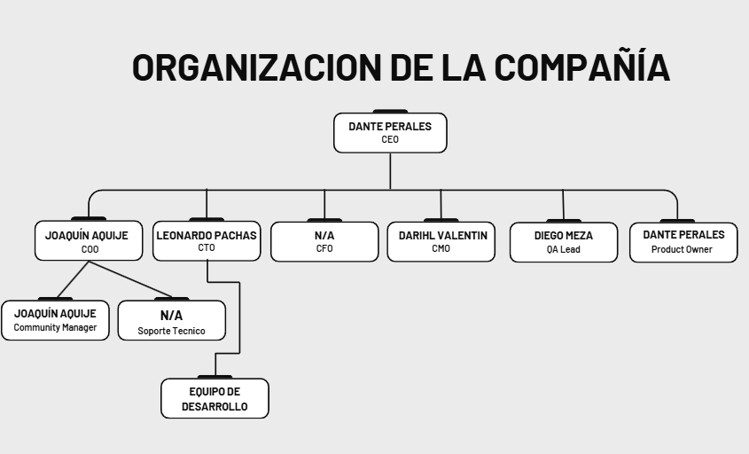

# 1.3. Estructura del Equipo

## Organigrama

---

## Roles y Responsabilidades

### CEO (Chief Executive Officer) – Dante Perales
Responsable general de la **visión, estrategia y ejecución** del proyecto. Define los objetivos estratégicos, lidera la toma de decisiones clave y representa a GameVault frente a socios, inversores y comunidades gamers. Supervisa todas las áreas críticas para mantener alineada la misión del proyecto.

---

### COO (Chief Operating Officer) – Joaquin Aquije
Encargado de la **gestión operativa diaria** de GameVault. Coordina a los equipos de desarrollo, marketing y soporte. Optimiza procesos internos y asegura que los plazos y entregables se cumplan. Gestiona la relación con empresas logísticas y soporte post-venta.

---

### CTO (Chief Technology Officer) – Leonardo Pachas
Lidera la **estrategia tecnológica** y la **arquitectura de la plataforma**. Define la seguridad, escalabilidad y elección de tecnologías clave. Supervisa al equipo de desarrollo (frontend, backend e integraciones con APIs externas) garantizando estabilidad y alto rendimiento.

---

### CFO (Chief Financial Officer) – *Pendiente de contratación*
Encargado de la **planificación financiera** y la sostenibilidad del proyecto. Administra presupuestos, flujos de caja y evalúa la viabilidad económica de expansiones. Lidera la búsqueda de inversión externa y modelos de monetización.  

---

### CMO (Chief Marketing Officer) – Darihl Valentin
Responsable de la **estrategia de marketing y posicionamiento de marca**. Diseña campañas digitales, gestiona redes sociales y genera alianzas con comunidades de gamers retro. Analiza métricas de engagement para mejorar la adquisición y retención de clientes.

---

### QA Lead (Quality Assurance) – Diego Meza
Encargado de **asegurar la calidad del producto** mediante pruebas funcionales, de rendimiento y seguridad. Diseña planes de testing y garantiza que las nuevas funcionalidades se liberen sin errores críticos, mejorando la experiencia del usuario final.

---

### Product Owner – Dante Perales
Puente entre **usuarios y desarrollo**. Prioriza necesidades de los clientes, define el roadmap del producto y traduce los requerimientos en historias claras para el equipo técnico. Supervisa el backlog y asegura que las entregas cumplan con los insights del mercado.

---

### Equipo de Desarrollo – Todos
El equipo implementa las funcionalidades técnicas de GameVault:
- **Frontend Developer** – Darihl Valentin  
- **Backend Developer** – Diego Meza  
- **Ingeniero DevOps / Infraestructura** – Leonardo Pachas + *Pendiente de contratación*  

---

### Equipo de Comunidad y Soporte
- **Community Manager** – Joaquin Aquije  
  Encargado de gestionar foros, reseñas y retroalimentación de los gamers.  

- **Soporte Técnico** – *Pendiente de contratación*  
  Ayuda a resolver incidentes de usuarios y mantiene la atención al cliente activa.  
