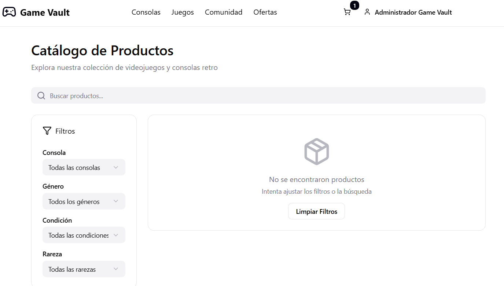
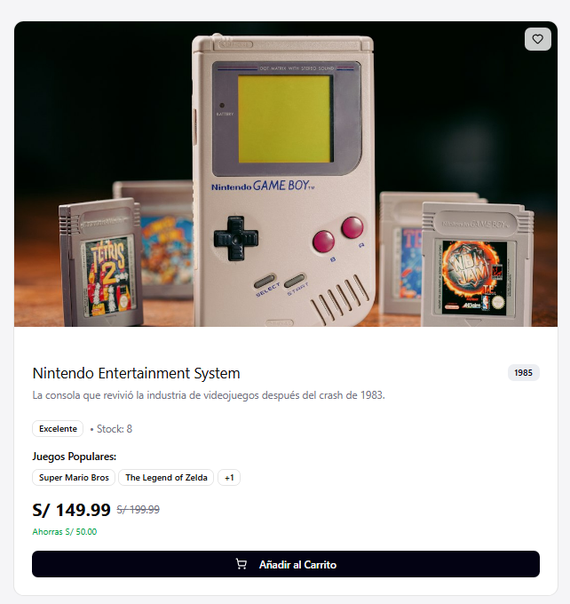

# 2.1.1. Módulo 1 - Catalogo de Productos
# Catálogo de Productos

| **ID** | **Nombre del Requisito** | **Historia de Usuario** |
|--------|----------------------------|---------------------------|
| RF-01 | Registro y gestión de productos | Como administrador, quiero registrar, editar y eliminar productos para mantener actualizado el catálogo. |
| RF-02 | Búsqueda de productos | Como usuario, quiero buscar juegos por nombre o palabra clave para encontrarlos rápidamente. |
| RF-03 | Filtros avanzados | Como usuario, quiero aplicar filtros por consola, género, disponibilidad, condición y rareza para refinar mis resultados. |
| RF-04 | Visualización de detalles | Como comprador, quiero ver la información detallada de un producto para conocer sus características antes de comprar. |
| RF-05 | Productos sugeridos | Como usuario, quiero ver productos relacionados para descubrir opciones similares o complementarias. |

Sample content for section 2.1.1.