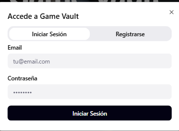
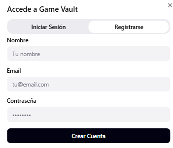

# 2.1.2. Módulo 2 - Gestion de Usuarios 
# Gestión de Usuarios

| **ID** | **Nombre del Requisito** | **Historia de Usuario** |
|--------|----------------------------|---------------------------|
| RF-01 | Registro de usuarios | Como visitante, quiero registrarme con mis datos personales para acceder al sistema. |
| RF-02 | Autenticación segura | Como usuario, quiero iniciar sesión de forma segura para acceder a mi cuenta. |
| RF-03 | Recuperación de contraseña | Como usuario, quiero recuperar mi contraseña si la olvido para no perder acceso a mi cuenta. |
| RF-04 | Roles de usuario | Como administrador, quiero asignar roles (comprador, vendedor, administrador) para gestionar los permisos del sistema. |
| RF-05 | Gestión de perfil | Como usuario, quiero editar mi perfil para mantener mi información actualizada. |
| RF-06 | Historial de transacciones | Como usuario, quiero consultar mi historial de compras o ventas para llevar control de mis operaciones. |
| RF-07 | Protección de datos | Como usuario, quiero que mi información esté cifrada para garantizar mi privacidad. |

Sample content for section 2.1.2.