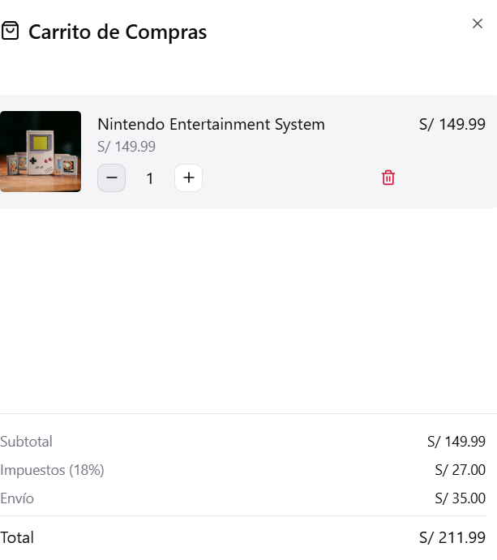

# 2.1.3. Módulo 3 - Carritos de Compras y Pedidos
# Carrito de Compras y Pedidos

| **ID** | **Nombre del Requisito** | **Historia de Usuario** |
|--------|----------------------------|---------------------------|
| RF-01 | Agregar productos al carrito | Como comprador, quiero agregar productos al carrito para comprarlos más tarde. |
| RF-02 | Modificar carrito | Como comprador, quiero eliminar o cambiar la cantidad de productos antes de pagar. |
| RF-03 | Cálculo automático de totales | Como usuario, quiero ver el precio total con impuestos y descuentos para conocer el costo final. |
| RF-04 | Generar pedido | Como comprador, quiero confirmar mi compra para generar un pedido oficial. |
| RF-05 | Confirmación de pedido | Como usuario, quiero recibir una confirmación del pedido para tener constancia de la compra. |
| RF-06 | Seguimiento del pedido | Como comprador, quiero ver el estado del pedido para saber si ya fue enviado o entregado. |

Sample content for section 2.1.3.