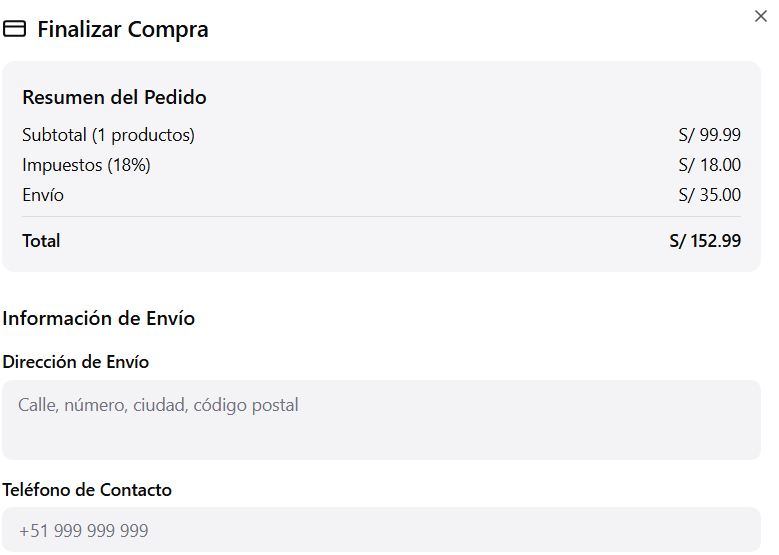
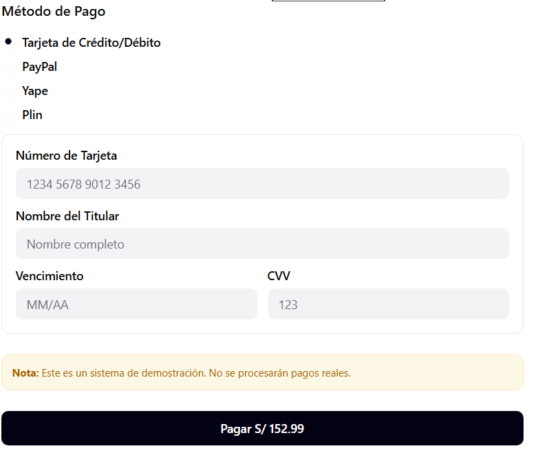

# 2.1.4. Módulo 4 - Sistemas de Pago
# Sistema de Pagos

| **ID** | **Nombre del Requisito** | **Historia de Usuario** |
|--------|----------------------------|---------------------------|
| RF-01 | Procesamiento seguro de pagos | Como comprador, quiero realizar pagos seguros para completar mis compras sin riesgos. |
| RF-02 | Integración con pasarelas de pago | Como usuario, quiero poder pagar con PayPal, Yape o Plin para usar mi método preferido. |
| RF-03 | Validación de transacciones | Como sistema, quiero verificar el éxito o fallo del pago para garantizar la integridad de la operación. |
| RF-04 | Emisión de comprobante digital | Como comprador, quiero recibir un comprobante digital para registrar mi compra. |
| RF-05 | Registro de transacciones | Como administrador, quiero registrar todas las transacciones para control contable y auditorías. |
| RF-06 | Protección de datos financieros | Como usuario, quiero que mis datos bancarios estén protegidos para evitar fraudes. |

Sample content for section 2.1.4.