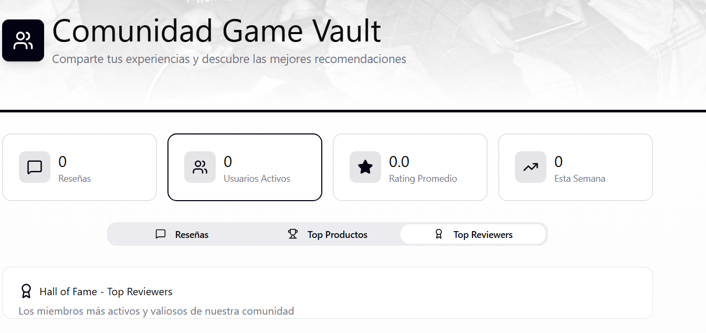
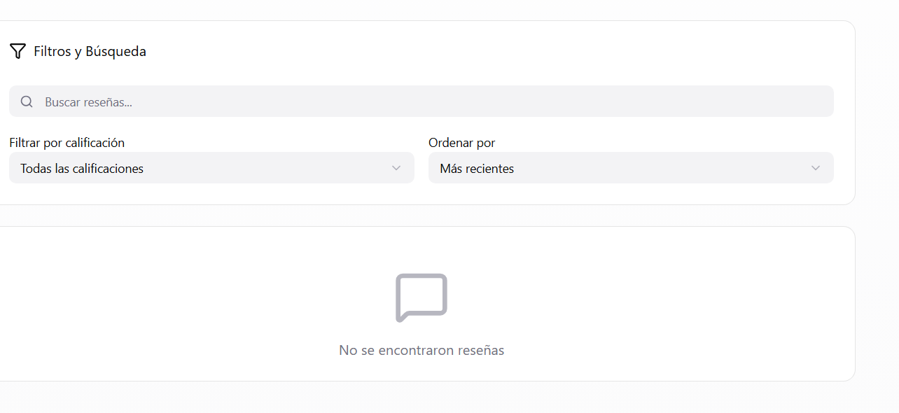
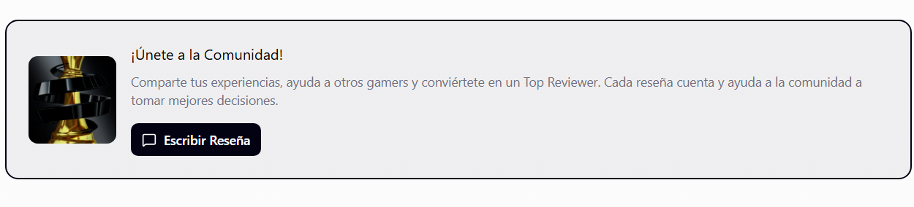

# 2.1.5. Módulo 5 - Comunidad y Reseñas
# Comunidad y Reseñas

| **ID** | **Nombre del Requisito** | **Historia de Usuario** |
|--------|----------------------------|---------------------------|
| **RF-01** | Publicar reseñas | Como comprador, quiero dejar reseñas de los productos que compré para compartir mi experiencia. |
| **RF-02** | Valorar productos y vendedores | Como usuario, quiero calificar productos y vendedores para ayudar a otros compradores. |
| **RF-03** | Comentarios y respuestas | Como usuario, quiero responder reseñas para interactuar con otros miembros de la comunidad. |
| **RF-04** | Reportar contenido inapropiado | Como usuario, quiero reportar publicaciones inadecuadas para mantener un ambiente seguro. |
| **RF-05** | Foros y discusiones | Como usuario, quiero participar en foros para compartir opiniones y consejos sobre juegos. |
| **RF-06** | Eventos y concursos | Como administrador, quiero crear eventos o concursos para aumentar la participación de la comunidad. |
| **RF-07** | Editar/Eliminar Contenido Propio | Como usuario, quiero poder editar o eliminar mis propias reseñas y comentarios para corregir errores o cambiar de opinión.|
| **RF-09** | Filtrar y Ordenar Reseñas | Como comprador, quiero filtrar y ordenar las reseñas (por más útiles, más recientes, por calificación) para encontrar la información más relevante para mí. |

Sample content for section 2.1.5.
