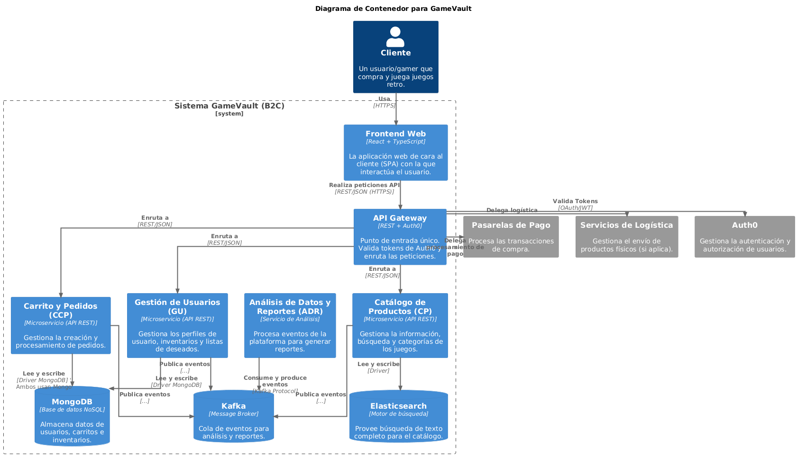

> [6. Documentación de Arquitectura](../6.md) › [6.2. Diagrama de Contenedores](6.2.md)

# 6.2. Diagrama de Contenedores

El **Diagrama de Contenedores** de *GameVault* muestra la arquitectura lógica del sistema, los principales contenedores de software (frontend, servicios de backend y sistemas externos) y sus relaciones.

Permite visualizar cómo se organizan las responsabilidades dentro del ecosistema y cómo se integran las tecnologías clave.

---

## Contexto del Diagrama

El **Diagrama de Contenedores** se ubica entre el *Diagrama de Contexto* (que muestra el sistema como una caja negra) y los *Diagramas de Componentes* (que detallan el interior de cada microservicio).

Describe la estructura técnica de la plataforma, mostrando las aplicaciones y bases de datos que conforman el sistema *GameVault*. Cada microservicio opera como un **contenedor independiente**, comunicándose con los demás de dos formas:

1.  **Síncrona:** A través de llamadas API directas, gestionadas por el **API Gateway**.
2.  **Asíncrona:** Mediante un bus de eventos interno (**Kafka**).

Este enfoque híbrido asegura **escalabilidad**, **mantenibilidad** y **resiliencia**.

---

## Descripción General

| Contenedor | Tecnología | Descripción |
| :--- | :--- | :--- |
| **Frontend Web** | React + TypeScript | Interfaz de usuario (SPA) con la que interactúan los **clientes**. |
| **API Gateway** | REST + Auth0 | Punto de entrada único que autentica, autoriza y enruta las solicitudes síncronas. |
| **Catálogo de Productos (CP)** | PostgreSQL + Elasticsearch | Gestiona productos, inventario y búsquedas optimizadas. |
| **Gestión de Usuarios (GU)** | PostgreSQL | Administra perfiles de usuario, roles y datos de la aplicación. |
| **Carrito y Pedidos (CCP)** | PostgreSQL + Redis | Orquesta el carrito de compras (Redis) y los pedidos persistentes (PostgreSQL). |
| **Sistema de Pagos (SP)** | PostgreSQL + Webhooks | Procesa pagos, rastrea transacciones y se integra con pasarelas externas. |
| **Comunidad y Reseñas (CR)**| MongoDB | Administra reseñas, valoraciones y contenido generado por el usuario. |
| **Análisis y Reportes (ADR)**| PostgreSQL (DW) + Kafka | **Consume** eventos de Kafka para generar métricas e informes en un Data Warehouse. |
| **Bus de Eventos** | Kafka | Infraestructura interna que maneja la comunicación asíncrona entre microservicios. |

---

## Interacciones Externas

El sistema *GameVault* depende de los siguientes sistemas externos de terceros:

* **Auth0:** Gestiona la autenticación (login) y autorización (permisos) de usuarios.
* **Pasarelas de Pago (PayPal, Yape, Plin):** Ejecutan las transacciones financieras de forma segura.
* **Servicios de Logística:** Reciben la información de los pedidos para coordinar la entrega física.

---

## Diagrama de Contenedores

---

## Conclusión

El diagrama refleja una arquitectura robusta basada en **microservicios independientes**. Estos servicios se integran mediante dos patrones claros: un **API Gateway** central para el tráfico síncrono (comandos) y un bus de eventos **Kafka** para la comunicación asíncrona (eventos).

Se evidencia un enfoque de **persistencia políglota** (usando PostgreSQL, Redis, MongoDB y Elasticsearch), permitiendo que cada servicio utilice la base de datos más adecuada para su tarea. Esta arquitectura asegura que GameVault mantenga una **alta disponibilidad**, **seguridad** y **escalabilidad horizontal** a medida que crece su base de usuarios.

---

[⬅️ Anterior](../6.1/6.1.md) | [🏠 Home](../../README.md) | [Siguiente ➡️](../6.3/6.3.md)
