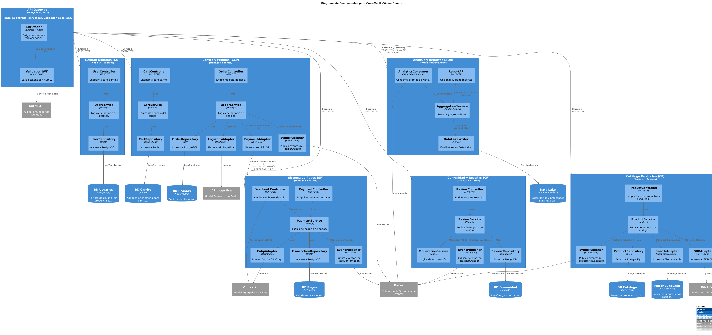

> [6. Documentación de Arquitectura](../6.md) › [6.3. Diagrama de Componentes](6.3.md)

## 6.3. Diagrama de Componentes

El **Diagrama de Componentes** detalla la estructura interna de los principales contenedores (microservicios) definidos en la arquitectura de GameVault. Especifica los módulos lógicos clave, servicios, repositorios y adaptadores que colaboran dentro de cada microservicio. Este nivel describe cómo se organizan estos componentes y cómo interactúan entre sí o con sistemas externos (bases de datos, APIs, Kafka).

---

## Descripción General

Cada microservicio encapsula sus propias responsabilidades, datos y lógica, siguiendo los principios de **alta cohesión** y **bajo acoplamiento**. Los componentes internos se organizan típicamente en capas funcionales:

| Tipo de Componente | Descripción                                   |

| :------------------- | :------------------------------------------------------------------------------- |

| **Controller** | Gestiona las solicitudes entrantes (HTTP/Eventos) y delega a los servicios.     |

| **Service** | Implementa la lógica de negocio principal y coordina las operaciones.       |

| **Repository** | Abstrae el acceso y la persistencia de datos en la base de datos del microservicio. |

| **Adapter/Client** | Encapsula la comunicación con otros microservicios o sistemas externos (APIs).  |

| **Publisher/Consumer** | Gestiona la publicación o consumo de eventos hacia/desde Kafka.         |

---

## Componentes Principales por Microservicio

### Catálogo de Productos (CP)

* **ProductController:** Expone endpoints REST para búsqueda, filtrado y detalle de productos.

* **ProductService:** Contiene la lógica de negocio del catálogo, incluyendo la consulta a IGDB y la gestión del stock (puede interactuar con CCP o un módulo de inventario futuro).

* **ProductRepository:** Gestiona el acceso a la base de datos **PostgreSQL** para los datos maestros de productos.

* **SearchAdapter:** Interactúa con **Elasticsearch** para indexar y realizar búsquedas de texto completo.

* **IGDBAdapter:** Cliente HTTP para obtener metadatos de videojuegos desde la **IGDB API**.

* **EventPublisher:** Publica eventos (ej. `ProductoActualizado`) en **Kafka**.

### Gestión de Usuarios (GU)

* **UserController:** Expone endpoints REST para obtener/actualizar perfiles de usuario específicos de GameVault.

* **UserService:** Implementa la lógica de negocio relacionada con los perfiles (preferencias, historial, etc.). Interactúa con Auth0 para obtener datos del usuario si es necesario.

* **UserRepository:** Gestiona el acceso a la base de datos **PostgreSQL** para los perfiles.

* *(Nota: La lógica de autenticación (login, registro, JWT) es manejada externamente por **Auth0** y validada en el **API Gateway**).*

### Carrito y Pedidos (CCP)

* **CartController:** Expone endpoints REST para gestionar el carrito de compras.

* **OrderController:** Expone endpoints REST para crear y consultar pedidos.

* **CartService:** Implementa la lógica de negocio para añadir/quitar ítems del carrito.

* **OrderService:** Orquesta el proceso de *checkout*, calcula precios, valida stock (interactuando con CP si es necesario), llama al Servicio de Pagos (SP) síncronamente y finalmente confirma el pedido.

* **CartRepository:** Gestiona el acceso a **Redis** para los datos volátiles del carrito.

* **OrderRepository:** Gestiona el acceso a **PostgreSQL** para la persistencia de los pedidos.

* **PaymentAdapter:** Cliente HTTP para realizar la llamada síncrona al Servicio de Pagos (SP).

* **LogisticsAdapter:** Cliente HTTP para enviar datos del pedido confirmado a la API de Logística externa.

* **EventPublisher:** Publica eventos (ej. `PedidoCreado`) en **Kafka**.

### Sistema de Pagos (SP)

* **PaymentController:** Expone el endpoint REST que recibe la solicitud de pago síncrona desde CCP.

* **WebhookController:** Expone el endpoint REST que recibe las notificaciones asíncronas (webhooks) desde **Culqi**.

* **PaymentService:** Implementa la lógica de negocio principal: iniciar el pago con Culqi, procesar la confirmación del webhook, y manejar posibles fraudes.

* **TransactionRepository:** Gestiona el acceso a la base de datos **PostgreSQL** para guardar el log inmutable de transacciones.

* **CulqiAdapter:** Encapsula toda la comunicación (inicio de pago, validación de webhooks) con la **API de Culqi**.

* **FraudValidator:** Componente interno (o servicio externo) que aplica reglas antifraude.

* **EventPublisher:** Publica eventos (ej. `PagoConfirmado`, `PagoFallido`) en **Kafka**.

### Comunidad y Reseñas (CR)

* **ReviewController:** Expone endpoints REST para crear, leer y gestionar reseñas y comentarios.

* **ReviewService:** Implementa la lógica de negocio, incluyendo la llamada al servicio de moderación.

* **ModerationService:** Componente (o servicio externo) que aplica reglas de moderación al contenido de las reseñas.

* **ReviewRepository:** Gestiona el acceso a la base de datos **MongoDB**.

* **EventPublisher:** Publica eventos (ej. `ReseñaCreada`, `ValoracionActualizada`) en **Kafka**.

### Análisis de Datos y Reportes (ADR)

* **AnalyticsConsumer:** Componente (escrito en Python) que se suscribe y consume eventos desde **Kafka**.

* **AggregationService:** Utiliza librerías como **Pandas/NumPy** para procesar, transformar y agregar los datos de los eventos.

* **DataLakeWriter:** Componente que escribe los datos procesados o brutos en el **Data Lake**.

* **(Opcional) ReportAPI:** Podría exponer endpoints REST (con Flask/FastAPI) para servir reportes precalculados desde un Data Warehouse si fuera necesario.

---

## Diagrama de Componentes

*(Aquí deberías insertar la imagen del diagrama de componentes actualizado que refleja esta estructura, idealmente generado con PlantUML).*

---

## Conclusión

Este nivel de detalle permite comprender la responsabilidad funcional de cada componente dentro de los microservicios de GameVault. Se muestra claramente la separación de responsabilidades (Controller, Service, Repository, Adapter), el uso de las tecnologías específicas (PostgreSQL, Redis, MongoDB, Elasticsearch, Kafka, Culqi, Auth0) y las interacciones clave. Esta estructura modular facilita la **escalabilidad**, el **mantenimiento** y la evolución independiente de cada parte del sistema.

⬅️ Anterior
 | 🏠 Home
 | Siguiente ➡️
