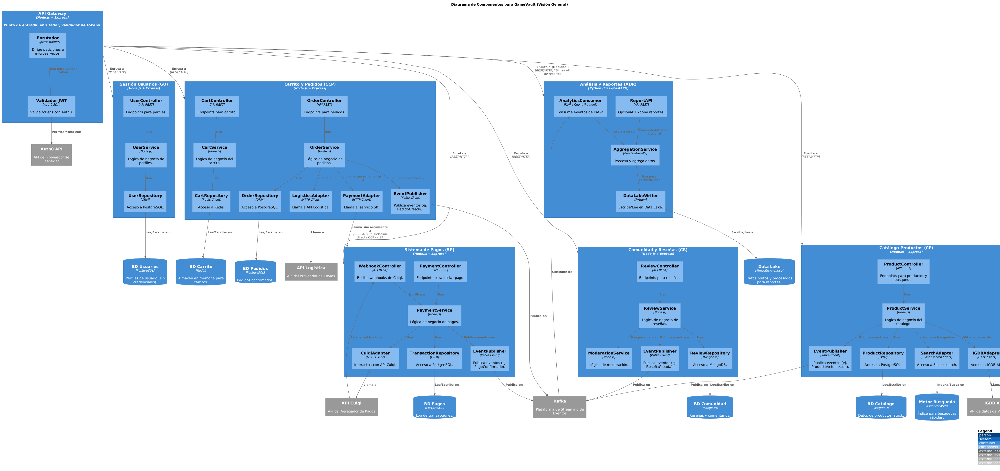

> [9. Metodología de Diseño de Arquitectura - Aplicación de ADD](../../9.md) › [9.2. Iteración 1: Definir la estructura general del sistema](../9.2.md) › [9.2.5. Vistas y Decisiones](9.2.5.md)

# 9.2.5. Vistas y Decisiones

### **Estructura de Microservicios Definida:**

**1. Microservicio de Catálogo de Productos**
* **Responsabilidades:** Gestión de juegos, control de inventario, búsqueda avanzada.
* **Tecnología:** Node.js + Express + PostgreSQL (Maestra) + Elasticsearch (Búsqueda) + Redis (Caché).
* **Patrones:** CQRS (separación lectura/escritura implícita), Cache-Aside, Gateway Aggregation.
* **Casos de Uso:** CU-05, CU-06, CU-07.

**2. Microservicio de Gestión de Usuarios**
* **Responsabilidades:** Perfiles de usuario, preferencias, sincronización con Auth0.
* **Tecnología:** Node.js + Express + PostgreSQL + Auth0.
* **Patrones:** Arquitectura en Capas.
* **Casos de Uso:** CU-01, CU-02, CU-03, CU-04.

**3. Microservicio de Carrito y Pedidos**
* **Responsabilidades:** Gestión temporal del carrito, creación de órdenes, checkout.
* **Tecnología:** Node.js + Express + Redis (Carrito) + PostgreSQL (Pedidos).
* **Patrones:** Datos Compartidos Híbrido, Saga (Orquestación de pedidos).
* **Casos de Uso:** CU-08, CU-09, CU-10.

**4. Microservicio de Sistema de Pagos**
* **Responsabilidades:** Interacción con Culqi, validación de webhooks, registro de transacciones.
* **Tecnología:** Node.js + Express + PostgreSQL + RabbitMQ (Cola de reintentos).
* **Patrones:** Queue-Based Load Leveling (para reintentos), Webhooks (Pub/Sub).
* **Casos de Uso:** CU-11, CU-12, CU-13.

**5. Microservicio de Comunidad y Reseñas**
* **Responsabilidades:** Reseñas, calificaciones, foros, moderación.
* **Tecnología:** Node.js + Express + MongoDB (Documental).
* **Patrones:** Arquitectura en Capas.
* **Casos de Uso:** CU-14, CU-15, CU-16, CU-17.

**6. Microservicio de Análisis y Reportes**
* **Responsabilidades:** Ingesta de eventos, generación de métricas de negocio.
* **Tecnología:** Python (Pandas) + Kafka (Ingesta) + PostgreSQL (Data Warehouse).
* **Patrones:** Pipe-and-Filter, Map-Reduce (Lógico), Publicar-Suscribir.
* **Casos de Uso:** CU-18, CU-19, CU-20.

### **Patrones y Tácticas Aplicadas por Atributo de Calidad:**

* **Disponibilidad:**
    * Redundancia activa en Kubernetes (Deployment Replicas).
    * Circuit Breaker en el API Gateway para fallos en cascada (QA-03).
    * Queue-Based Load Leveling en Pagos (DEC-4, DEC-10).
* **Rendimiento:**
    * Cache-Aside con Redis en Catálogo y Carrito (DEC-4).
    * Elasticsearch para búsquedas de texto completo y fuzzy search (QA-12).
    * Comunicación asíncrona (Kafka) para tareas no bloqueantes (Analítica).
* **Seguridad:**
    * Autenticación centralizada con Auth0 (DEC-3).
    * Validación de Webhooks de Culqi con firma criptográfica (DEC-10).
    * Aislamiento de red (Patrón Multi-Tier) para bases de datos.
* **Escalabilidad:**
    * Horizontal Pod Autoscaler (HPA) en Kubernetes para servicios stateless (M1, M3).
    * Particionamiento de tópicos en Kafka.

---

[⬅️ Anterior](../9.2.4/9.2.4.md) | [🏠 Home](../../../README.md) | [Siguiente ➡️](../9.1.6/9.1.6.md)